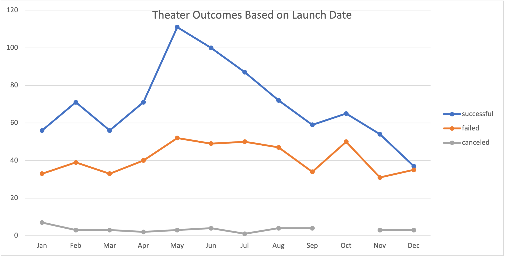

# Kickstarting with Excel

## Overview of Project

### Purpose
The purpose of this project is to evaluate outcomes of various (theater/play) campaigns based on their launch date and fundraising goals, to ultimately arm Louise with data and analyses to help determine the best way to plan and launch her own. We did this by formatting/converting, extracting, filtering, and presenting relevant data through pivot tables, graphs, and various functions such as year(), =sum() and =countifs().

## Analysis and Challenges

### Analysis of Outcomes Based on Launch Date

* Throughout all the months, there were more successful campaigns than failed campaigns and canceled campaigns.
* The months of May, June, and July had the highest number of succesful campaigns. Out of all the months, May had the most number of succesful campaigns.

### Analysis of Outcomes Based on Goals

* There is slight inverse trend where as the fundraising goal increases the success rate decreases. 
* There is a higher percentage of successful campaigns than failed campaigns at the $0-10k and $35k-$45k fundraising goal ranges.

### Challenges and Difficulties Encountered
I had a lot of errors when writing out my countifs(). Manually entering the ranges and then changing the "failed", "successful", "cancelled" field was tedious and when I went to make the graphs my data was off because of syntax or typo errora. I am still working on my understanding of pivot tables and how each field should be placed to structure /pull data that I want to look at. 

## Results

- What are two conclusions you can draw about the Outcomes based on Launch Date?

Louise should aim to launch her campaigns in the spring time, specifically May and June, which had the highest number of successful campaigns. October could potentially be a bad time to launch a campaign.

- What can you conclude about the Outcomes based on Goals?

Louise should aim to have a campaign goal of less than $20k, it is at this point where the percentage of failures is greater than the percentage of successes. 

- What are some limitations of this dataset?
Using percentages for Theater Outcomes Based on Launch Date would have been more useful information that a count. While it is visible that there are more successful campaigns than failed, we want to know at what rate/in relation to the total number of campaigns.

- What are some other possible tables and/or graphs that we could create?
We could create a table that looks at duration of the campaign and outcomes.